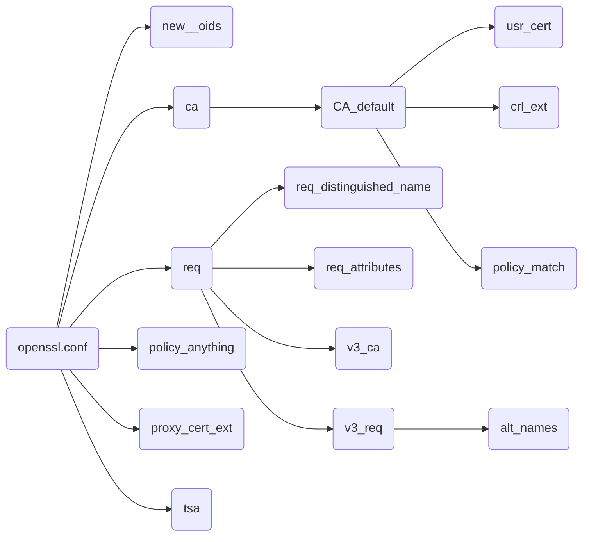

```mermaid
graph LR;

1(openssl.conf)-->2(new__oids)
1-->3(ca)
1-->4(req)
1-->5(policy_anything)
1-->6(proxy_cert_ext)
1-->7(tsa)

3-->8(CA_default)
8-->9(usr_cert)
8-->10(crl_ext)
8-->11(policy_match)

4-->12(req_distinguished_name)
4-->13(req_attributes)
4-->14(v3_ca)
4-->15(v3_req)
15-->16(alt_names)


```

